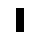

# Order

Random is fine, but order is better. 

In this step we'll still start from a random state, but the subsequent updates will
follow the rules of Conway's Game of Life, which will create a more ordered pattern.

The grid randomization is now done once when the game starts and a new `NextState()`
method is called on each game update.

## Goal
 - Implement the `CountAliveNeighbors()` method in `grid.go` to count the number of alive neighbors of a given cell.
 - Implement the `NextState()` method in `grid.go` to update the grid state according to the rules of Conway's Game of Life.

If you implemented it right, you should see a more ordered pattern emerge.

If you wait long enough, you may see one of the most famous patterns in Conway's Game of Life, the "Glider".

It is one of the many spaceships in Conway's Game of Life.
It moves diagonally across the grid and is a great example of how simple rules can lead to complex behavior.

You may also see some oscillators, which are patterns that repeat after a certain number of generations.

The simplest one is the "Blinker":

You shall now proceed to the [next step](./../03-optimization/README.md).