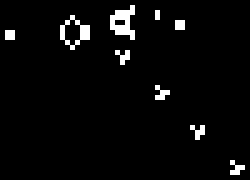

# The GOL Dojo

## Test your environment

Make sure go is installed and available in your PATH.

```bash
$ go version
```

It should display go version 1.24 or higher.

Then run the following command to test your environment:

```bash
$ go run .
```

You should see a window with the following content:


Make sure the top left corner displays values close to 60 FPS & TPS.

## Game of life?

Also known as _Conway's Game of Life_, this is a cellular automaton devised by the British 
mathematician John Horton Conway in 1970.

The game consists of a grid of cells, where each cell can be either alive or dead. 
An alive cell is represented by a white pixel, while a dead cell is represented by a black pixel.

The state of the cells evolves over discrete time steps according to a set of rules based on the states
of neighboring cells.

The rules are as follows:
 1. Any live cell with fewer than two live neighbours dies, as if by underpopulation.
 2. Any live cell with two or three live neighbours lives on to the next generation.
 3. Any live cell with more than three live neighbours dies, as if by overpopulation.
 4. Any dead cell with exactly three live neighbours becomes a live cell, as if by reproduction.

### Example



## Visual rendering engine

For this Dojo, we'll use [Ebitengine](https://ebitengine.org/), a lightweight game engine for Go.

>💡 There is other game engines available and all of them will let you create a window, draw pixels and handle inputs.
But we are not here to debate which one is better, we are here to learn Go and have fun.

## Getting started

Ebitengine expects a struct that implements the `ebiten.Game` interface.

```go
package main

struct Game struct {
    func (g *Game) Update() {
        // Update the game state/logic here
    }
	
    func (g *Game) Draw(screen *ebiten.Image) {
        // Draw the game state to the screen here
    }
	
    func (g *Game) Layout(w, h int) (int, int) {
        // Controls the game size relative to the window size
        // Don't worry about this for now
        return w, h
    }
}
```

Once you've implemented the `Game` struct, you can create a new game instance and start the game loop.

```go
package main

import (
    "github.com/hajimehoshi/ebiten/v2"
)

func main() {
    game := &Game{}
	
    ebiten.SetWindowSize(500, 500)
    ebiten.SetWindowTitle("GOL Dojo")
    
    if err := ebiten.RunGame(game); err != nil {
        panic(err)
    }
}
```

When you run a game, the engine will try to call the `Update` and `Draw` methods at a fixed rate
(60 times per second by default). This is what is displayed in the top left corner of the window in the first example.

>💡 **FPS**: frames per second, the number of times the screen is drawn per second.

>💡 **TPS**: ticks per second, the number of times the game logic is updated per second.

The engine will try to keep the game running at this fixed rate, but it may go down showing a heavy loaded
system and/or a too complex game logic. You should always keep an eye on the FPS and TPS values while developing a game.

## Let's begin!

Now you know the basics of the engine and how to create a game loop, you're ready to move
to the [first step](./01-chaos/README.md).